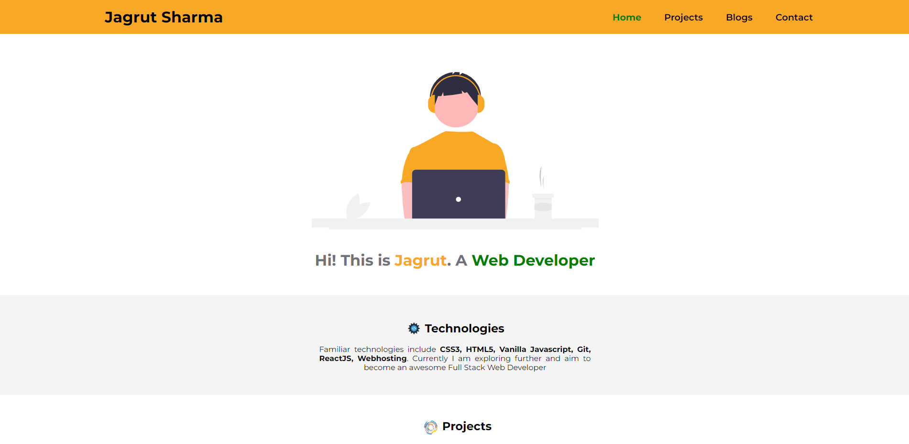
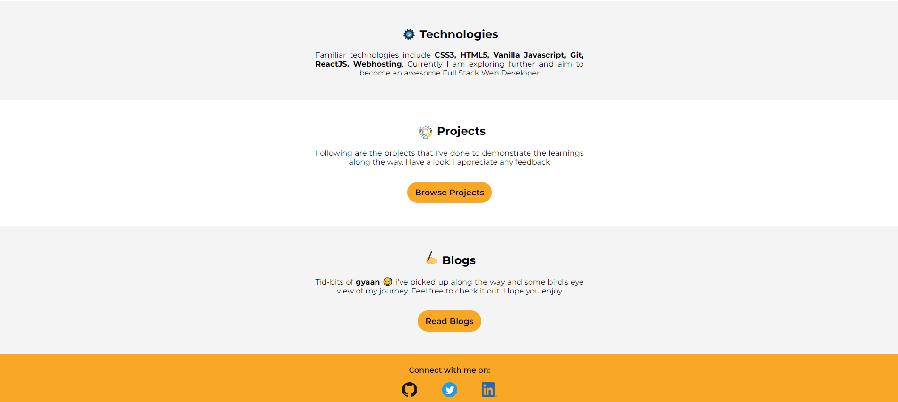

# Jagrut's Portfolio

Hi. This is Jagrut. This is my personal portfolio that i am buiding for neoG Camp.

I am learning web development, i will learn a lot and develop cool and awesome apps.

Till now I know:

1. Node.js (A little bit)
1. CHALK
1. Vanilla Javascript
1. React JS
1. HTML
1. CSS
1. Markdown

This portfolio is designed through HTML and CSS. It is responsive by design. Visit [here.](https://jagrut-sharma.netlify.app/)

